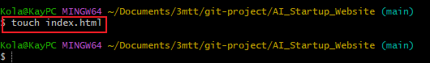

# AI_Startup_Website
This is a learning repository as a DevOps Engineer
# Collaborative Website Development with Git and GitHub

In this mini project, we'll create a step-by-step project to simulate the workflow of Tom and Jerry using Git and GitHub. This hands-on project will include installation of Git, setting up a GitHub repository, cloning the repository, creating branches, making changes, and merging those changes back into the main branch.

## Part 1: Setup and Initial Configuration

### Step 1: Install Git

    Windows: Download the Git installer from git-scm.com and run it.

    Git was installed successfully and confirmed by running git version in the terminal.

 add-contact-info

### Step 2: Create a Git Repository

A Github repository was created with the name *AI-Startup-website*

 add-contact-info

### Step 3: Clone the Repository

In the terminal, I created a directory named *git project*. I navigated into it, and then cloned the repository into the directory.

 add-contact-info

## I navigate into the cloned repository.

## I created an index.html file in the cloned repository.

## I added content to the index.html file.

## I checked the changes made has not been staged for commit.

## I added the changes to the staging area.

## I checked the status again to confirm the changes have been staged.

## I committed the changes with a message.

## Then I pushed the main branch to GitHub.

## I navigate into the cloned repository.

## I created an index.html file in the cloned repository.

## I added content to the index.html file.

## I checked the changes made has not been staged for commit.

## I added the changes to the staging area.

## I checked the status again to confirm the changes have been staged.

## I committed the changes with a message.

## Then I pushed the main branch to GitHub.

 main

## Part 2: Simulating Tom and Jerry's Work

### Tom's work

### I checked the branch I am currently working on.

 add-contact-info

### I created a new branch for Tom's work.

### I checked the branch again to confirm I am on the Tom's branch.

### I edited the index.html file to add Tom's content

### I checked the status to confirm the changes have not been staged.

### I added the changes to the staging area.

### I checked the status again to confirm the changes have been staged

### I committed the changes with a message.

### I pushed the Tom's branch to GitHub.

### I created a new branch for Tom's work.

### I checked the branch again to confirm I am on the Tom's branch.

### I edited the index.html file to add Tom's content

### I checked the status to confirm the changes have not been staged.

### I added the changes to the staging area.

### I checked the status again to confirm the changes have been staged

### I committed the changes with a message.

### I pushed the Tom's branch to GitHub.

## Jerry's work

### I switched back to the main branch.

### I pulled the latest changes from the remote repository to ensure I have the latest version of the main branch.

### I created a new branch for Jerry's work.

### I staged Jerry's changes to the index.html file and commited them with a message.

### I pushed Jerry's branch to GitHub.

### I pulled the latest changes from the remote repository to ensure I have the latest version of the main branch.

### I created a new branch for Jerry's work.

### I staged Jerry's changes to the index.html file and commited them with a message.

### I pushed Jerry's branch to GitHub.

